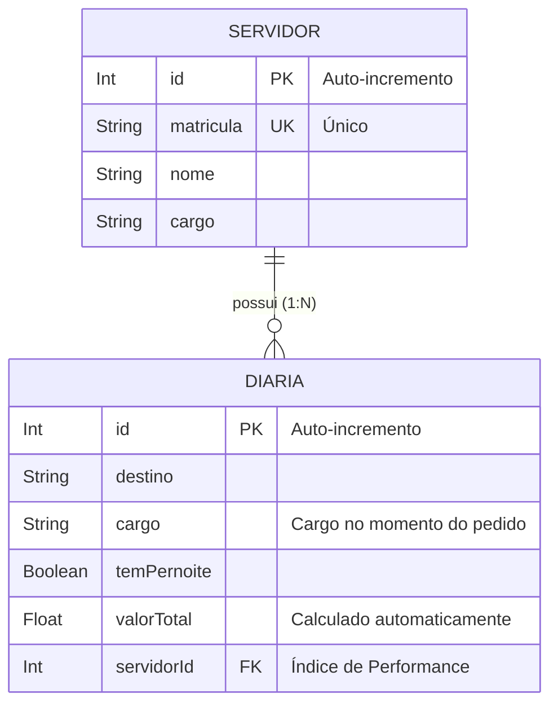

# 🏛️ Sistema de Gestão de Diárias em Órgãos Públicos (SGDOP)

Este projeto consiste em um ecossistema computacional completo para automação, cálculo e auditoria de concessão de diárias de viagem para servidores públicos. A solução é composta por uma API robusta desenvolvida em **NestJS** e uma interface reativa SPA construída em **React + Vite**.

## 📊 Modelagem do Domínio (Diagrama Relacional)

O sistema utiliza persistência real de dados em um banco de dados relacional com um relacionamento de 1 para Muitos (1:N). O diagrama abaixo é renderizado nativamente pelo GitHub:



---

## 🛠️ Como Executar o Projeto Localmente

Para rodar a aplicação completa na sua máquina, siga os passos abaixo divididos por ambiente.

### 1. Inicialização do Backend (NestJS)

Abra o terminal do seu sistema operacional, navegue até a pasta do backend e execute os comandos de instalação e sincronização de banco:

```bash
# Entrar na pasta do backend
cd pedido-diarias-senac

# Instalar as dependências do ecossistema NestJS
npm install

# Sincronizar o schema do Prisma e gerar o cliente do banco de dados SQLite
npx prisma db push

# Inicializar o servidor em modo de desenvolvimento
npm run start:dev
```
* **API Principal:** O servidor backend estará ativo no endereço `http://localhost:3000`
* **Documentação Swagger (OpenAPI):** Acesse as rotas interativas em `http://localhost:3000/api`
* **Prisma Studio (Auditoria Visual do Banco):** Caso queira inspecionar as tabelas graficamente, abra um terminal paralelo na pasta do back e execute `npx prisma studio` (disponível em `http://localhost:5555`).

### 2. Inicialização do Frontend (React + Vite)

Abra uma **nova aba de terminal paralela** (mantendo o backend rodando), navegue até a pasta do frontend e execute os comandos:

```bash
# Entrar na pasta do frontend
cd frontend-diarias

# Instalar os pacotes necessários (como Axios)
npm install
```

> ⚠️ **Nota para compatibilidade de Node.js (Ambientes Restritos):** Se o ambiente de desenvolvimento possuir uma versão do Node.js anterior à exigida nativamente pelo motor do Vite/Rolldown (ex: `v20.18.0`), execute o comando abaixo para instalar o binário nativo ignorando as restrições de motor:
> ```bash
> npm install @rolldown/binding-win32-x64-msvc --no-engine-strict
> ```

Com as dependências instaladas, inicialize a interface web:

```bash
# Execução ignorando a validação rígida de motor do Node no terminal
$env:VITE_BYPASS_NODE_VERSION_CHECK="true"; npx vite
```
* **Interface Gráfica (SPA):** Acesse a aplicação abrindo o navegador no endereço `http://localhost:5173`

---

## 🧪 Guia de Testes Rápidos (Regras de Negócio)

Para validar o cálculo automático e o tratamento de erros diretamente na interface (`http://localhost:5173`), utilize a massa de dados parametrizada abaixo:

### 1. Parâmetros Válidos do Sistema
* **ID do Servidor Solicitante:** Utilize `1` ou `2` (IDs padrões criados no SQLite).
* **Cargos Aceitos pelo Sistema:** `Operacional`, `Técnico` ou `Gestão` (Sensível a maiúsculas/minúsculas).

### 2. Cenários Recomendados para Homologação
* **Teste 1: Cálculo Padrão (Sem Acréscimos)**
  * **Input:** Destino: `Canoas` | Cargo: `Técnico` | ID: `1` | Pernoite: **Marcado**
  * **Resultado Esperado:** Valor Total = **R$ 350.00** (Valor base do cargo).
* **Teste 2: Adicional de Destino Especial (+30%)**
  * **Input:** Destino: `Porto Alegre` ou `Brasília` | Cargo: `Técnico` | ID: `1` | Pernoite: **Marcado**
  * **Resultado Esperado:** Valor Total = **R$ 455.00** (R$ 350.00 base + 30%).
* **Teste 3: Fator Bate-Volta / Sem Pernoite (-50%)**
  * **Input:** Destino: `Canoas` | Cargo: `Gestão` | ID: `2` | Pernoite: **Desmarcado**
  * **Resultado Esperado:** Valor Total = **R$ 300.00** (R$ 600.00 base reduzido pela metade).
* **Teste 4: Tratamento de Exceção (Validação Front/Back)**
  * **Input:** Tente enviar o formulário com o campo Cargo vazio ou use um ID de servidor inexistente (ex: `999`).
  * **Resultado Esperado:** O sistema interceptará o erro e exibirá uma caixa vermelha de alerta amigável contendo o motivo da recusa.

---

## 🚀 Principais Recursos Implementados

* **Performance:** Cache em memória RAM (respostas em **0 ms** via `@nestjs/cache-manager`), Paginação real de dados nativa no banco de dados (`skip` e `take` do Prisma) e Índice de Performance relacional (`@@index`).
* **Segurança:** Proteção contra ataques de força bruta (*Rate Limiting* via Throttler), injeção de 15 cabeçalhos protetores (*Helmet*), políticas restritas de *CORS* e sanitização de dados via *ValidationPipes (Whitelist)*.
* **Resiliência (Tratamento de Erros):** Captura de exceções global unificada. Dados incorretos enviados à API são interceptados pelo front-end e exibidos de forma amigável em componentes visuais na tela, evitando interrupções na SPA.